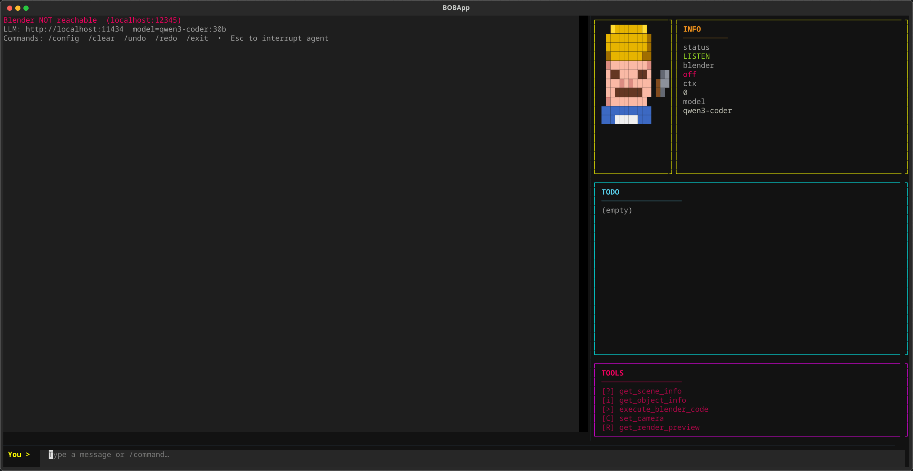
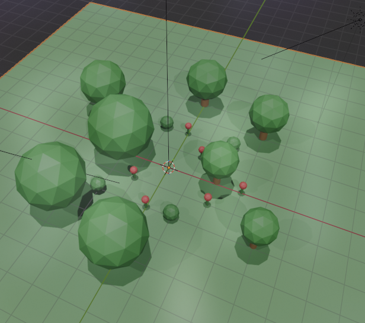

# BOB — Blender Operating Bot

AI-powered Blender automation through a terminal interface and a local LLM (Ollama).



## How it works

```
Blender (>= 5.0)
└── addon.py — socket server on :12345

agent_tui.py — TUI → Ollama LLM → Blender socket
```

You type natural language commands in the TUI. BOB sends them to a local Ollama model, which plans and executes a sequence of Blender API calls via the addon's socket server.

## Requirements

- Blender >= 5.0
- Python 3.11+ with Conda / Mamba
- Ollama running locally or on the network with a model loaded

## Installation

**1. Set up the environment**
```bash
conda create -n blender python=3.11 && conda activate blender
pip install -e .
```

**2. Install the Blender addon**
1. Open Blender → Edit → Preferences → Add-ons
2. Click the arrow in the top-right corner → Install from Disk → select `addon.py` → enable **BOB**
3. In the top bar **BOB** menu, set the port and click **Connect**

**3. Configure Ollama**

Edit `agent_config.json`:
```json
{
  "ollama_url": "http://<ollama-host>:11434",
  "ollama_model": "qwen3-coder:30b",
  "blender_host": "localhost",
  "blender_port": 12345
}
```

Or type `/config` inside the TUI to edit settings interactively:


## Usage

```bash
conda activate blender
bob-agent
```

Type natural language to control Blender:

```
Create a red cube at the origin
Add a sun light and render a preview
Arrange 10 trees in a circular pattern
```

The quality of results depends on the model — `qwen3-coder:30b` handles most scene modifications well.

**TUI commands:** `/config` &nbsp; `/clear` &nbsp; `/undo` &nbsp; `/redo` &nbsp; `/exit`

**Keyboard shortcuts:** `Esc` — interrupt the running agent mid-task

## Example: Design a Garden



## Security

BOB is designed for **local, single-user development use only**.

The Blender addon exposes a TCP socket on `localhost:12345` with no authentication — any process on the same machine can send it commands, including arbitrary code execution inside Blender. This is an intentional trade-off for simplicity.

**Do not run BOB on shared servers, cloud VMs, or any environment where other users have shell access.**

All communication stays on your local network. Your prompts and Blender data go only to your Ollama server — nothing is sent to the internet.

## Troubleshooting

| Symptom | Fix |
|---|---|
| `Blender NOT reachable` | Ensure the addon is enabled and **Connect** was clicked |
| Port conflict | Change `blender_port` in `agent_config.json` and the port in the Blender addon panel to match |
| Wrong model | Run `/config` and update the Ollama model name |
